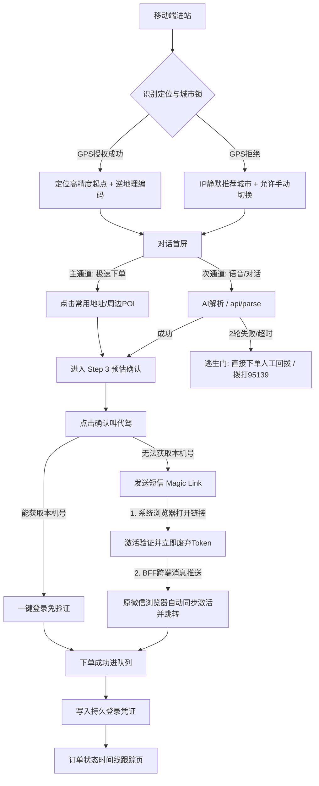

# e代驾移动端 Web 叫代驾下单链路 · 产品设计审计报告

本审计报告针对 2026-06-27 版《移动端 Web 叫代驾下单链路 · 设计文档》进行系统架构与酒后用户体验的深度评估。

---

## 1. 设备分流（第 0 步）评估：CDN 缓存与视口硬伤

### 🔍 隐患分析
1. **服务端无法感知物理视口**：设计文档中提出“UA + 视口兜底；服务端 SSR 直接渲染两套首屏”。但服务端（Express）在接收到 HTTP 请求时，是**无法感知客户端视口宽度**的。视口判定只能在客户端执行。
2. **CDN 缓存灾难**：若在生产环境部署了 CDN 缓存或 Nginx 反向代理缓存，若没有针对 `User-Agent` 进行缓存隔离，会导致移动端用户拿到缓存的 PC 页面，或者 PC 用户拿到移动端页面。
3. **维护成本高**：维护两套完全隔离的 HTML 模板（营销站 vs 下单对话流）在长线迭代中容易出现链接、埋点不一致。

### 🛠 重构建议
- **响应式优先（CSS @media）**：首选方案是采用一套统一的 HTML 页面，通过 CSS 媒体查询在 PC 端隐藏叫车组件并展示扫码下载区，在移动端则反之。这天然规避了 UA 误判和 CDN 缓存问题。
- **若必须 SSR 分流**：
  - 服务端（BFF）必须配置 `res.setHeader('Vary', 'User-Agent')` 告知 CDN 缓存服务器按 UA 隔离。
  - 客户端 `app.ts` 必须编写 UA 误判兜底逻辑：若客户端宽度小于 `768px` 却加载了 PC 模板，应动态加载移动端交互组件，避免用户卡死在 PC 静态展示页。

---

## 2. 区域识别层评估：蜂窝网络定位漂移与 AI 解析死结

### 🔍 隐患分析
1. **IP 定位误差大**：移动端酒后用户逆地理编码常依赖 4G/5G 蜂窝网络，其出口 IP 极易产生跨市漂移（例如廊坊燕郊漂移至北京，佛山漂移至广州）。
2. **AI 解析逻辑死结**：设计文档规定“切城即重置 POI 检索域并重解析”且“城市锁只约束起点和解析上下文”。如果 IP 错误将用户锁在“北京”，而用户身处“廊坊燕郊”打字输入“我在燕郊步行街，回燕京航天城”，AI 被强行限制在北京范围内检索 POI，将导致“检索不到 POI”或“强行匹配至北京同名地址”，直接造成下单失败。

### 🛠 重构建议
- **城市推荐（Bias）而非城市硬锁（Constraint）**：AI 的 POI 检索应当将 IP 推定城市作为**首选过滤偏好**。当在推定城市内检索置信度极低时，必须**自动放开至全国/周边城市检索**，并弹窗温和提示：“检测到您可能在【廊坊市】，是否一键切换？”。
- **首选 GPS 授权而非静默 IP**：若用户已授权 GPS，直接以 GPS 经纬度逆地理编码（`/api/geo`）反查城市，作为最高优先级。

---

## 3. 叫车链路体验审计（酒后场景约束）

### 🔍 隐患分析
1. **酒后用户耐心极限**：酒后用户（尤其是中重度酒后）打字困难、口齿不清、带有强烈焦虑感。IM 对话流（说一句 -> AI 追问 -> 再说一句 -> 确认）看似新颖，实则对于心智受损的用户是极高的**认知负荷**。
2. **ASR（语音转写）与 LLM 串联延迟**：
   - 移动端 Web 录音（依赖 Web Audio 或微信 JS-SDK） -> 上传音频 -> BFF 转写（ASR） -> LLM 解析 -> 生成卡片并下发。
   - 这一链路在 3G/4G 弱网环境下的网络延迟通常高达 **3-6 秒**。在此期间，若页面无实时反馈，醉酒用户极易因“以为卡死”而流失。

### 🛠 重构建议
- **“双轨制”极速下单通道**：首屏对话界面下方，必须常驻「历史常用地址」（如“🏡 回家”、“🏢 回公司”） and 「当前定位周边 3 个地标 POI」的**一键点击胶囊按钮**。用户只需点击“🏡 回家”，即可瞬间填满起终点并跳转 Step 3 确认页，**0 对话交互，1秒下单**。
- **逃生口前置**：在 ASR/LLM 解析 loading 超过 3 秒时，界面应自动浮现大红色的「一键转 95139 电话叫车」或「提交语音，由人工话务员回拨联系」，杜绝技术卡死。

---

## 4. 短信 Magic Link（魔术链接）评估：跨沙箱割裂与工程闭环方案

> [!IMPORTANT]
> ### 🚨 坚持使用 Magic Link 的技术代价与工程闭环方案
> 
> 由于您坚持在叫车链路中使用 Magic Link，为彻底消除“微信浏览器与系统浏览器沙箱隔离”导致的会话割裂及登录态丢失问题，我们必须引入**跨浏览器会话同步机制**。

### 🔍 痛点剖析
- **跨 App 浏览器沙箱隔离（会话割裂）**：当用户在微信（占移动流量 70%+）中操作，收到短信并点击 Magic Link 时，手机系统会在系统默认浏览器中打开链接。
- **后果**：系统浏览器写入了登录 Cookie，但用户返回微信后，微信页面依然在“等待点击”的死循环里，且微信内依然是未登录状态。

### 🛠 工程闭环落地方案（微信-系统浏览器跨端同步）
为了确保 Magic Link 的丝滑体验，BFF 与客户端必须实施以下设计：

1. **生成沙箱绑定会话（Client Session ID）**：
   - 微信端叫车页面载入时，客户端生成唯一的 `ws_client_id`。
   - 微信端通过 WebSocket 连接 BFF，或者发起长轮询监听：`GET /api/order/verify-status?clientId=ws_client_id`。
2. **Token 短生命周期与一次性消费（Single-Use）**：
   - 短信链接格式：`https://www.edaijia.cn/api/verify/click?token=JWT_TOKEN`
   - `JWT_TOKEN` 中签入 `ws_client_id`、手机号、订单核心要素。
   - **安全策略**：此 Token 有效期设为 3 ~ 5 分钟，且在 BFF 侧引入 Redis 缓存进行 **Single-use（一次性消费）** 标记。一经点击验证，Token 立即拉黑，防止重放攻击。
3. **跨端登录凭证（JWT Cookie）回传与激活**：
   - 用户在短信中点击链接，系统浏览器激活验证接口 `GET /api/verify/click`。
   - BFF 验证成功后，立即通过 WebSocket 或长轮询长连接，将生成的**持久登录凭证（Session Token）推送给对应的微信端 `ws_client_id`**。
   - 微信浏览器接收到推送，本地写入 LocalStorage/Cookie 恢复登录态，并**自动跳转到订单状态页**，在微信内完成闭环。
   - 系统浏览器端仅展示“验证成功，请返回微信查看”或直接展示只读状态页。
4. **鉴权与隐私防漏**：
   - 坚决杜绝一链三用。魔术链接 Token 验证通过即作废，后续状态跟踪、取消订单必须依赖回传给微信或系统浏览器的标准 JWT Cookie 鉴权。

---

## 5. BFF 接口与后台设计评估

### 🔍 隐患分析
1. **`/api/parse` 接口被刷风险**：该接口会调用大语言模型（LLM）API，成本高昂。若被黑产使用自动化脚本恶意刷接口，将导致严重的云服务账单暴增。
2. **多轮对话上下文无状态存储**：文档提出“BFF无状态，多轮携带上下文”。这意味着前端必须自己维护并向 BFF 传输完整的 `chat_history` 数组，如果用户对话轮次过多，传输体积会增大。

### 🛠 重构建议
- **LLM 熔断与强限频**：
  - 在 BFF 侧针对单个 IP 和手机号实施严格 of `/api/parse` 调用限频（如单会话 1 分钟最多调用 5 次，超出则强制熔断，降级为文本输入表单，不再调用 AI）。
  - 限制 `chat_history` 的最大传输轮数为最近 3 轮，避免恶意构造超长 Context 烧 Token。
- **`/api/order/:token` 轮询限频**：
  - 状态跟踪页轮询间隔必须随着订单状态变化而退避（如：已受理阶段 5s/次，司机已接单后 15s/次），减小核心后台的数据库读压力。

---

## 6. 审计结论与一期改进架构图

### 🎯 审计总结
- **最大亮点**：设备分流合理，将注册融入下单流程，极大地缩短了新客叫车路径。
- **致命软肋**：**Magic Link 带来的跨浏览器沙箱会话割裂**，以及**纯 IM 对话在酒后高压场景下的认知阻碍**。
- **改进核心**：引入 **“双轨制”极速通道**，基于 **Client Session ID + 跨端长连接同步** 闭环 Magic Link 体验，并设置 **BFF 侧 LLM 防刷强限频**。
